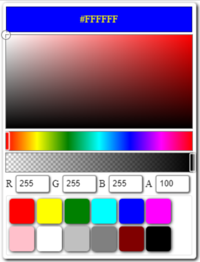

# Fav Color Picker React
### color picker component with favourites color list that return color object having all properties that any developer required in coding. 

# View Demo

[codesandbox-example](https://codesandbox.io/s/fav-color-picker-react-demo-k8c0to) 

[ghpages-example](https://developergovindgupta.github.io/fav-color-picker-react/)

[gitHub-SourceCode](https://github.com/developergovindgupta/fav-color-picker-react)

## How to install

    npm install fav-color-picker-react

## How to import

    import ColorPicker from "fav-color-picker-react";

## How to use

    <ColorPicker/>;

## Props

|property|type|default value|Description|
|--|--|--|--|
|color|string|"Red"|any valid string color value.|
|width|number|300|width of color palette|
|height|number|200|height of color palette|
|favourites|array of strings|[ ]|List of favourite colors that user can select|

## onChange Event

    <ColorPicker onChange={(e)=>{console.log(e.color,e.type)}}/>

## onChange event handler argument e.color value

| Property|	Description &lt; ColorObject &gt;|
|--|--|
|.name|	Name of color defined in css3|
|.rgb|	String rgb color value|
|.rgba|	String rgba color value|
|.hex|	String Hexa code of color|
|.hexa|	String Hexa code of color with alpha value|
|.hsl|	String HSL color|
|.hsla|	String HSL color with alpha value|
|.r|	Numeric Red Value|
|.g|	Numeric Green Value|
|.b|	Numeric Blue Value|
|.a|	Numeric Alpha Value Floating Point|
|.h|	Numeric Hue Value|
|.s|	Numeric Saturation Value|
|.l|	Numeric Lightness Value|
|.str|	String that is passed for conversion of color|
|.isValid|true if passed string is valid color string or valid html colorName.|

## onChange event handler argument e.type value

|value|description|
|--|--|
|mousedown mousemove mouseup|when mouse action on color-picker, hue and alpha slider|
|touchstart touchmove touchend|when touch action on color-picker, hue and alpha slider|
|rgbchange|when rgb textbox value change|

## Example - 2

    import ColorPicker, { colorPickerChangeResult, ColorObject } from "fav-color-picker-react";

    <ColorPicker
        color='red'
        width={300}
        height={150}
        onChange={(e: colorPickerChangeResult) => {
            document.body.style.backgroundColor=e.color.rgba;
        }}
        favourites={['red', 'yellow', 'green', 'cyan', 'blue', 'magenta', 'pink', 'white', 'silver', 'gray', 'maroon', 'black']}
    />

NOTE : for TypeScript onChange event argument type must be specify :colorPickerChangeResult

    type colorPickerChangeResult = {
        color: ColorObject;
        type: string;
    };

# View Demo

[codesandbox-example](https://codesandbox.io/s/fav-color-picker-react-demo-k8c0to) 

[ghpages-example](https://developergovindgupta.github.io/fav-color-picker-react/)

[gitHub-SourceCode](https://github.com/developergovindgupta/fav-color-picker-react)

# License Free to use

# Author

## developergovindgupta (Govind Prasad Gupta)

## Email : govindprasadguptamca@gmail.com 
